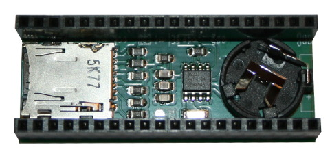
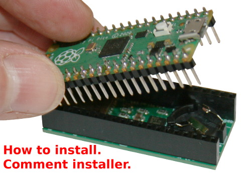

[Ce fichier existe également en FRANCAIS](readme.md)

# Using Pico-DataLog-Boot with MicroPython
The Pico-Datalog-boot is a Pico Expansion board fitting a RTC (Reak Time Clock) and a microSD. 



This expansion contains everything you need to deal with datetime and with large file storage (read/write files on a sd card is really great)

# Install from MASTER

The [masters.out/](masters.out) folder contains ZIP archive with all required files (examples scripts and libraries). 

Extract the files and copy them on your MicroPython plateform and "Voila !".

# Install the Libraries

The library must be copied on the MicroPython board before using the examples.

You can install the libraries from the master image or by issuing the following commands. 

On a WiFi capable plateform:

```
>>> import mip
>>> mip.install("github:mchobby/esp8266-upy/pcf8523")
```

Or via the mpremote utility :

```
mpremote mip install github:mchobby/esp8266-upy/pcf8523
```

Copy the `sdscard.py` file from the micropython-lib repository:

* [micropython-lib/micropython/drivers/storage/sdcard](https://github.com/micropython/micropython-lib/tree/master/micropython/drivers/storage/sdcard)

# Wiring 

Just plug your Pico on the Pico-Datalog-boot. Take care to place the pico USB over the CR1220 cell coin.



# Testing

The required library must be installed prior to run the MicroPython examples scripts.

About examples:

The `examples` sub-folder contains well documented scripts.

* __[test_sd_detect.py](examples/test_sd_detect.py)__ : how to check the presence of SDCard in the connector.
* __[test_sd_mount.py](examples/test_sd_mount.py)__ : how to mount/unmount the SDCard into the MicroPython filesystem (list the files).
* __[test_getdate.py](examples/test_getdate.py)__ : how to read datetime from RTC
* __[test_setdate.py](examples/test_setdate.py)__ : how to update the RTC datetime (it must be done once)
* __[test_alarm.py](examples/test_alarm.py)__ : experiment with the alarm feature of the RTC.
* __[test_attribute.py](examples/test_attribute.py)__ : read the RTC attributes.

It is a great idea to read them to discover the features.

# Shopping List
* [Pico-DataLog-Boot](https://shop.mchobby.be/fr/pico-rp2x/2912-carte-data-logger-pour-raspberry-pi-pico-3232100029125.html) is available @ MCHobby